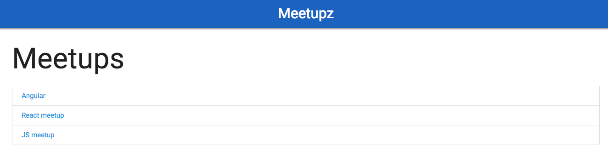
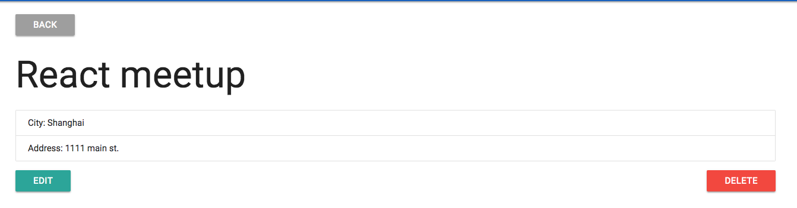
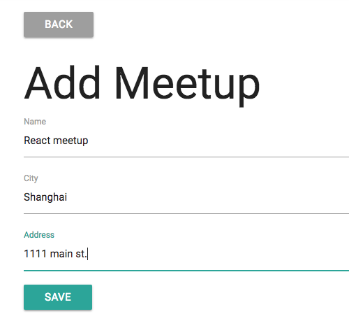

# Meetupz Full Stack React & LoopBack Application

This is a full stack application built with React, LoopBack and MongoDB.
This application can be used to:
* Add meetup event
* View existing meetup events
* Edit existing meetup event
* delete existing meetup event

You need MongoDB installed as we are using the Mongo connector for Loopback




### Usage

From the root folder (meetupz), install the dependencies

```sh
$ npm install
```
To run the server

```sh
$ npm start
```

App:
http://localhost:3000
Loopback explorer:
http://localhost:3000/explorer

### React client_src Usage 
This is the react source code. This is the code you edit

Open a new terminal in the "client_src" folder

```sh
$ npm install -g create-react-app
```

From the "client_src folder" install client dependencies

```sh
$ npm install
```

 To Serve client

 ```sh
$ npm start
```

This should start on port 3001

### Compile React client_src

From the "client_src" folder run

 ```sh
$ npm run build
```

This will put all static assets in the Loopback "client" folder and update the main app